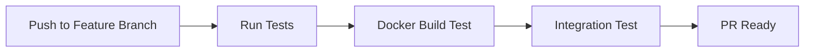
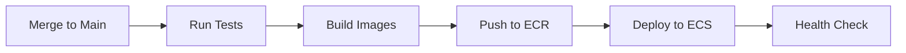

# CI/CD Pipeline for Rediguard

This repository includes a comprehensive CI/CD pipeline using GitHub Actions for automated testing, building, and deployment to AWS.

## Pipeline Overview

### 🧪 Test Pipeline (`test.yml`)
**Triggers:** All branches except `main`, Pull Requests to `main`

**Features:**
- **Multi-language Testing**: Python 3.12 + Node.js 22
- **Code Quality**: ESLint, TypeScript checking, Python linting
- **API Testing**: Health checks and endpoint validation
- **Docker Testing**: Build verification and integration tests
- **Redis Integration**: Full Redis Stack testing

### 🚀 Deploy Pipeline (`deploy.yml`)
**Triggers:** Push to `main` branch only

**Features:**
- **Secure Authentication**: AWS OIDC (no long-lived credentials)
- **Multi-stage Build**: Test → Build → Deploy → Verify
- **Container Registry**: Push to AWS ECR
- **Health Checks**: Post-deployment validation
- **Deployment Summary**: Detailed GitHub summary

## Required GitHub Secrets

Configure these in **Settings → Secrets and Variables → Actions**:

| Secret Name | Description | Example Value |
|-------------|-------------|---------------|
| `AWS_ACCOUNT_ID` | Your AWS Account ID | `123456789012` |
| `AWS_REGION` | AWS deployment region | `us-east-1` |
| `ECR_REGISTRY` | ECR registry URL | `123456789012.dkr.ecr.us-east-1.amazonaws.com` |
| `ECS_CLUSTER_NAME` | ECS cluster name (optional) | `rediguard-cluster` |
| `ECS_SERVICE_NAME` | ECS service name (optional) | `rediguard-app` |

## ECR Repository Setup

### Automatic Setup
Run the provided script to create ECR repositories:

```bash
./scripts/setup-ecr.sh
```

### Manual Setup
```bash
# Backend repository
aws ecr create-repository --repository-name rediguard-backend

# Frontend repository  
aws ecr create-repository --repository-name rediguard-frontend
```

## AWS OIDC Configuration

The pipeline uses OpenID Connect for secure, keyless authentication with AWS.

### Required IAM Role
- **Role Name**: `GitHubActionsRole`
- **Trust Policy**: Configured for your repository
- **Permissions**: ECR push/pull, ECS deployment (if used)

See `docs/AWS_OIDC_SETUP.md` for detailed setup instructions.

## Pipeline Workflow

### Development Flow


### Production Flow


## Image Tagging Strategy

- **Git SHA**: `rediguard-backend:abc123def`
- **Latest**: `rediguard-backend:latest`
- **Retention**: Keep last 10 tagged images, delete untagged after 1 day

## Monitoring and Troubleshooting

### GitHub Actions Dashboard
- **Actions Tab**: View pipeline runs
- **Summary**: Deployment details and status
- **Logs**: Detailed execution logs

### Common Issues

**OIDC Authentication Failed**
```bash
# Verify role exists and trust policy is correct
aws iam get-role --role-name GitHubActionsRole
```

**ECR Push Failed**
```bash
# Check repository exists
aws ecr describe-repositories --repository-names rediguard-backend
```

**Test Failures**
```bash
# Run tests locally
docker compose -f compose.yml up -d
curl http://localhost:8000/health
curl http://localhost:3000/api/health
```

## Local Development

### Test the Pipeline Locally
```bash
# Run the same tests as CI
cd backend && uv run uvicorn main:app --reload &
cd frontend && npm run dev &

# Run health checks
curl http://localhost:8000/health
curl http://localhost:3000/api/health
```

### Docker Testing
```bash
# Test Docker builds
docker compose build

# Test full stack
docker compose up

# Test individual services
docker build -t test-backend ./backend
docker build -t test-frontend ./frontend
```

## Security Features

- ✅ **No Stored Credentials**: OIDC-based authentication
- ✅ **Least Privilege**: Repository-specific IAM role
- ✅ **Image Scanning**: ECR vulnerability scanning enabled
- ✅ **Encrypted Storage**: ECR repositories use AES256 encryption
- ✅ **Access Control**: Branch protection and required reviews

## Performance Optimizations

- **Caching**: npm and Python dependencies cached
- **Parallel Jobs**: Tests and builds run concurrently
- **Layer Optimization**: Multi-stage Docker builds
- **Resource Limits**: Appropriate GitHub Actions runners

## Environment-Specific Deployments

### Development
```yaml
environment: development
branches: [develop, feature/*]
auto-deploy: false
```

### Staging
```yaml
environment: staging  
branches: [staging]
auto-deploy: true
```

### Production
```yaml
environment: production
branches: [main]
auto-deploy: true
approval-required: true
```

## Extending the Pipeline

### Add New Environments
1. Create environment-specific secrets
2. Add conditional deployment jobs
3. Configure environment protection rules

### Add Integration Tests
1. Extend `test.yml` with API tests
2. Add end-to-end testing with Playwright/Cypress
3. Include performance testing

### Add Notifications
```yaml
- name: Notify Slack
  if: failure()
  uses: 8398a7/action-slack@v3
  with:
    status: failure
    channel: '#deployments'
```

## Support

For issues with the CI/CD pipeline:
1. Check GitHub Actions logs
2. Verify AWS permissions
3. Test locally with Docker Compose
4. Review ECR repository configuration

---

*Last updated: August 2025*
